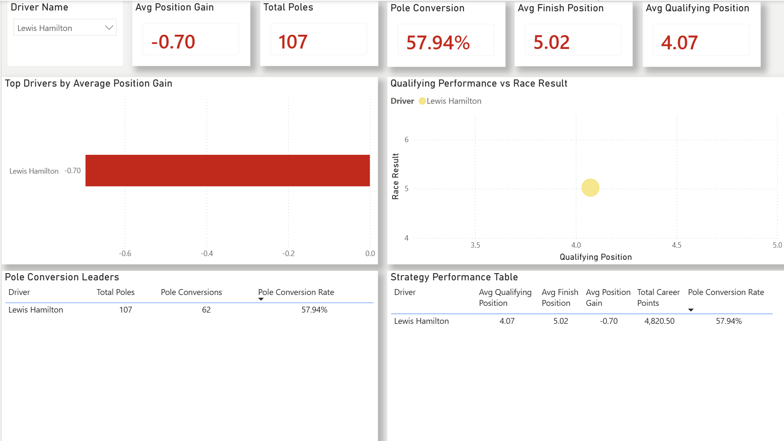
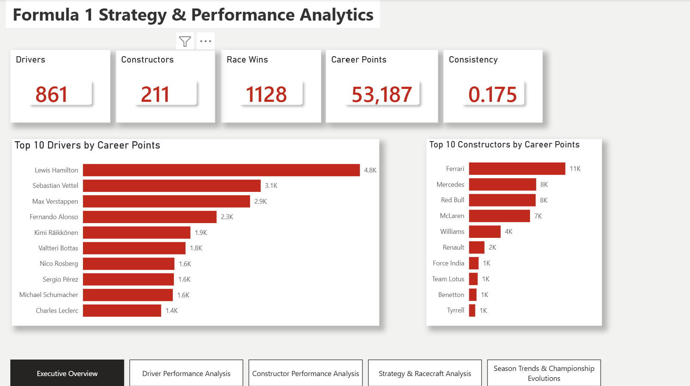
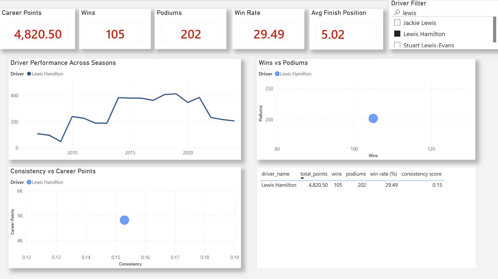
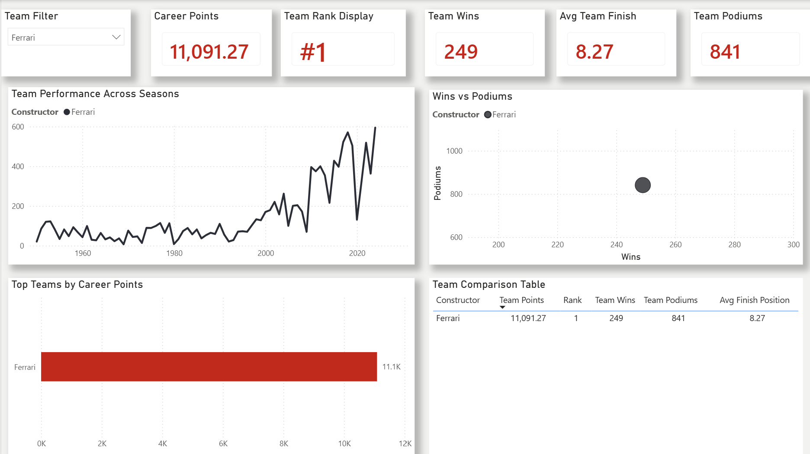
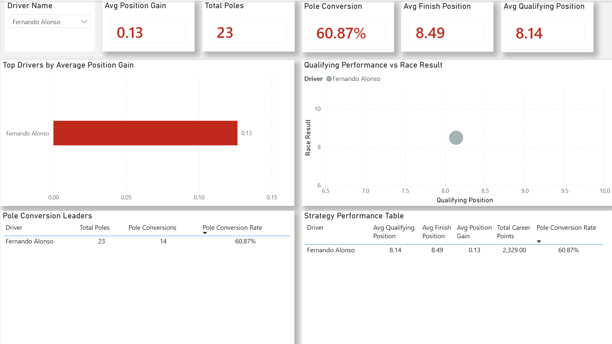
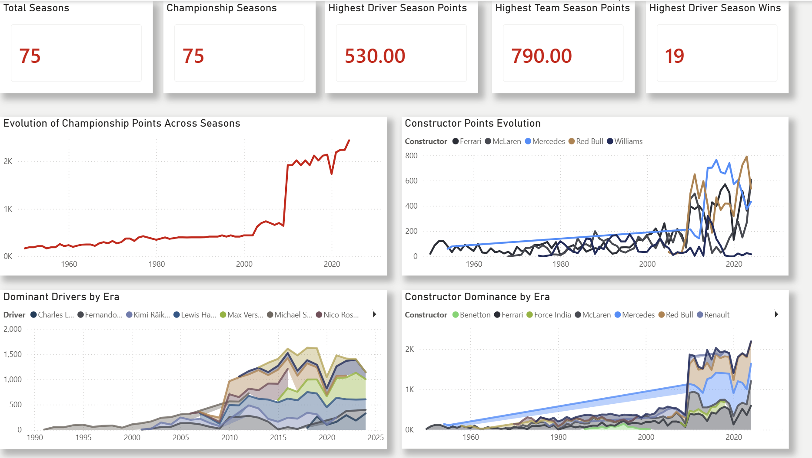

# 🏎️ Formula 1 Strategy Analytics Dashboard



A comprehensive Formula 1 analytics project built using **Python**, **Pandas**, **Power BI**, and **DAX**.

The project analyzes over **26,000 race records across 75 Formula 1 seasons**, uncovering insights into driver performance, constructor dominance, racecraft, qualifying effectiveness, and championship evolution.

---

# 📌 Project Overview

This project follows a complete analytics pipeline:

```text
Raw F1 Data
    ↓
Data Cleaning
    ↓
Feature Engineering
    ↓
KPI Generation
    ↓
Power BI Dashboard
    ↓
Business Insights
```

The goal was to transform historical Formula 1 race data into an interactive analytics solution suitable for executive reporting and performance analysis.

---

# 🛠️ Tech Stack

- Python
- Pandas
- NumPy
- Power BI
- DAX
- Git
- GitHub

---

# 📊 Dataset

Source:

Ergast Formula One Database

The project combines multiple Formula 1 datasets including:

- Race Results
- Drivers
- Constructors
- Qualifying Results
- Circuits
- Seasons

---

# ⚙️ Data Engineering Pipeline

## 1. Data Cleaning

Performed:

- Missing value handling
- Data type conversion
- Dataset merging
- Duplicate removal
- Date formatting

---

## 2. Feature Engineering

Created custom analytics metrics:

### Position Gain

```text
Grid Position - Finish Position
```

Measures a driver's ability to gain positions during a race.

### Pole Flag

```text
1 if driver qualified P1
0 otherwise
```

### Pole Conversion Flag

```text
1 if driver started P1 and won
0 otherwise
```

### Qualifying-Finish Delta

```text
Finish Position - Qualifying Position
```

Measures performance relative to qualifying.

---

## 3. KPI Generation

Generated:

- Driver KPIs
- Constructor KPIs
- Seasonal Driver KPIs
- Seasonal Constructor KPIs

---

# 📈 Dashboard Pages

---

# Page 1: Executive Overview

Provides a high-level summary of Formula 1 performance metrics.

### Key Features

- Total Drivers
- Total Constructors
- Total Races
- Total Points
- Average Consistency Score
- Top Drivers
- Top Constructors
- Historical Trends



---

# Page 2: Driver Performance Analysis

Analyzes career performance of Formula 1 drivers.

### Key Features

- Career Points
- Wins
- Podiums
- Consistency Score
- Performance Trends
- Driver Comparison



---

# Page 3: Constructor Performance Analysis

Evaluates Formula 1 teams across all seasons.

### Key Features

- Team Points
- Wins
- Podiums
- Team Rankings
- Constructor Dominance
- Seasonal Trends



---

# Page 4: Racecraft & Strategy Analysis

Focuses on race execution and qualifying effectiveness.

### Key Features

- Average Position Gain
- Pole Conversion Rate
- Qualifying vs Race Performance
- Strategy Metrics
- Driver Racecraft Analysis



---

# Page 5: Season Trends & Championship Evolution

Explores Formula 1 evolution over 75 seasons.

### Key Features

- Championship Evolution
- Driver Dominance by Era
- Constructor Dominance by Era
- Seasonal Performance Trends



---

# 📂 Project Structure

```text
Formula1-Strategy-Analytics
│
├── data
│   ├── raw
│   └── processed
│
├── scripts
│   ├── data_cleaning.py
│   ├── feature_engineering.py
│   └── kpi_generation.py
│
├── dashboard
│   └── F1_Strategy_Analytics.pbix
│
├── screenshots
│   ├── page1_overview.png
│   ├── page2_driver_analysis.png
│   ├── page3_constructor_analysis.png
│   ├── page4_strategy_analysis.png
│   └── page5_season_trends.png
│
├── requirements.txt
├── .gitignore
└── README.md
```

---

# 🚀 Key Business Insights

### Driver Performance

- Identified drivers with the highest career points and consistency scores.
- Compared race performance against qualifying performance.

### Constructor Analysis

- Evaluated long-term team dominance.
- Measured constructor success across multiple eras.

### Racecraft Analysis

- Quantified position gains achieved during races.
- Evaluated pole position conversion effectiveness.

### Historical Evolution

- Analyzed how Formula 1 performance trends evolved across 75 seasons.
- Identified dominant drivers and constructors by era.

---

# 🎯 Skills Demonstrated

- Data Cleaning
- Data Transformation
- Feature Engineering
- Exploratory Data Analysis
- KPI Development
- Power BI Dashboard Design
- DAX Measures
- Data Visualization
- Business Intelligence
- Git Version Control

---

# 👨‍💻 Author

Vyom Mangtani